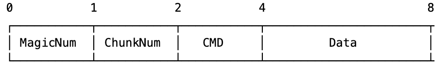
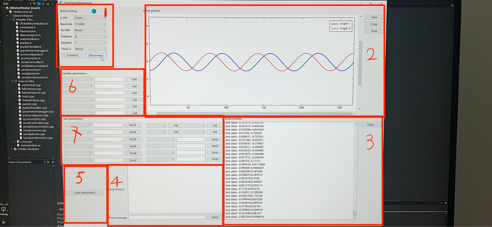
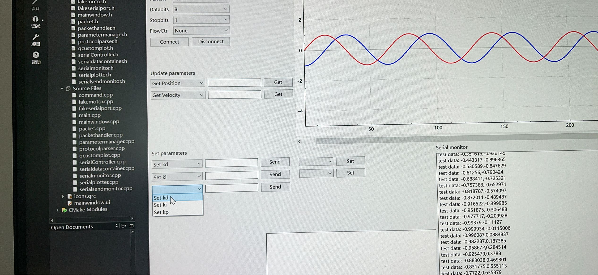

# OpenSerialDebugger:

我开发这款软件的原因是：最近我在为我的机器人手臂项目制作一个闭环步进电机驱动器。我希望能够调节PID，并且希望通过点击一些按钮来控制电机。但我没有找到任何一款串口调试软件能够同时支持这两种场景。有些软件可以通过按钮比如“设置Kp”、“设置Ki”来调节PID，但不能像“启用电机”或“设置位置”这样控制电机。

当然，我可以在代码中编写一些硬编码的原始串口字节数据和单片机通信，但这样的话，每次都需要手动修改代码中的参数并重新烧录。所以，为什么不以一种更直观和优雅的方式来实现呢？只需使用一个软件就可以应对各种场景。

相当于将通信需要用到的底层的字节数据归类，抽象和和封装起来，使用者可以直接在这些'sdk'的基础上自定义自己需要的指令，在软件上直接使用，和下位机交互。在下位机上的代码也不需要和原始字节数据打交道，packet.h里面提供了解析数据包指令和数据格式转换的函数。

## 简介
这是一款特殊的串口调试器，它具有基本的串口调试功能：串口监视器、串口绘图器，类似于大多数串口调试器。
在此基础上，它提供了一种灵活且可扩展的方式与单片机交互：

定义了一种基于串口的协议，用于传输自定义指令和数据。用户可以为不同的场景、项目或硬件定义所需的指令，OpenSerialDebugger将解析这些指令并在UI中列出，用户可以为每个按钮分配指令。
在下位机上只需要编写一个switch case块来处理这些指令（你也可以复制粘贴我demo的代码然后稍微修改）

### 数据包结构


这是一个8字节的基于串口的数据包，包含以下字段：
- Magic number: 用于验证数据包是否有效
- Chunk num:    默认值为1，保留用于将来扩展以携带多个数据。
- CMD:          指令编号。
- Data:         32位原始数据负载，足以满足单片机的需求。

### 指令

#### 指令类型:
OpenSerialDebugger与单片机硬件之间的交互抽象为三种指令类型：Set、Get 和 Act（Switch）
- Set：主机 -> 硬件。让单片机设置一个参数或变量。例如设置Kp、设置Ki。
- Get：硬件 -> 主机。一旦单片机收到此指令，它应将当前参数值发送给主机，例如获取速度。
- Act（Switch）：主机 -> 硬件，单片机执行一个动作，例如启用电机、复位。

#### 指令名称和指令编号:
每个指令应具有一个名称和唯一的ID，范围为0x00 - 0xff。

#### 数据类型
目前支持int、uint、bool和float类型(bool其实也是当作uint来处理的)，均为32位长度。

以下是如何定义指令的示例：
```bash
Set kp, SET, 0x01, int
Set ki, SET, 0x02, float
Set kd, SET, 0x03, uint

Get Position, GET, 0x04, int
Get Velocity, GET, 0x05, float

Stop Motor, ACTION, 0x06, bool
Enable Motor, ACTION, 0x07, bool
```
## 用户界面 (UI)


1. 串口设置。
2. 串口绘图器，提取并绘制数字（VOFA+ fire water格式："some text: data1, data2, ..."）。支持自动模式并将数据保存为CSV。
3. 串口监视器。（当前不支持时间戳）
4. 串口发送监视器，用户可以通过串口发送消息。
5. 加载自定义指令，用户可以在文件中定义自定义指令并将其加载到6和7中的指令列表中。
6. & 7. 加载自定义指令后，用户可以点击组合部件并从指令列表中选择一个指令名称。对于Set指令，给它一个值并点击发送按钮，指令将被发送到单片机。



## 单片机端代码示例
- 此视频展示了一个简单的和Arduino交互控制led灯的demo。只需包含packet.h并添加数据包处理函数，你就可以轻松控制LED。


https://github.com/user-attachments/assets/07579193-73ff-4853-b639-029d5e8ee3be

- 第二个演示，见示例
examples/motor/openSerialDebugger_motor_demo.mp4
  
有关此电机控制演示的单片机端代码示例(通过设计合适的指令，可以同时设置pid参数和其他控制电机的指令)，请参见cpp文件中的handle_packet()函数：
https://github.com/xiaochutan123l/MyRobotArm-stepperMotor/blob/main/App/Applications/Src/packet_test.cpp

## 关于下一个版本:

- 目前就是使用的最简单的qt自带的控件，风格很粗犷，我也知道不好看，我已经着手重构代码和用qml重新设计ui
- 目前我自己使用和测试了目前的版本，可以从demo里面看到是基本符合预期的，可能会有我没考虑到的bug，希望大家理解，使用过程中发现任何bug或者可以改进的地方欢迎大家告诉我

- 未来的版本的改进计划：
1. 将协议扩展到一次携带多个数据，
2. 扩展指令类型及其控件类型，尽可能覆盖不同应用场景下更多的需求
3. 将基于串口的协议更改为开放协议，也就是说用户可以通过txt文件自定义协议，这样更加灵活
4. 扩展和支持更多通信协议，比如CAN，TCP/UDP等